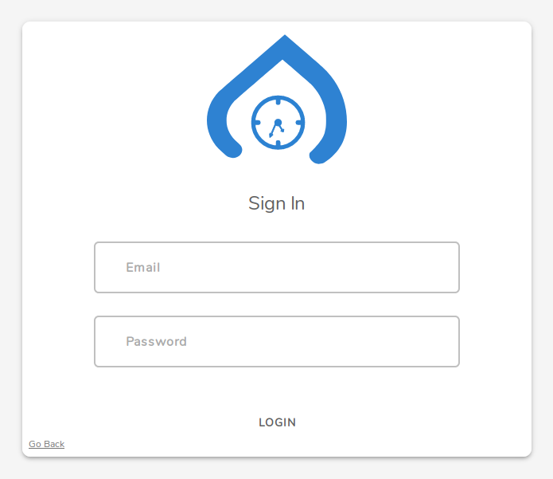

===================================================================================================
Guia de com crear un projecte  en Athena
===================================================================================================

.. sectnum::

.. contents:: Taula de Continguts

Introducció
~~~~~~~~~~~~~~
En aquest document està descrit com crear un projectes  en el gestor de projectes Athena.

Passos a seguir
~~~~~~~~~~~~~~~~~~
Iniciar sessió  
----------------------------------
Per poder crear projectes en l'aplicació web s'ha de haver iniciat sessió un amb un usuari que tingui els permisos corresponents (permís :  *Project Management*  o  *Project Administrator*)

Accedir a la secció de projectes
-------------------------------------------------
Un cop hagis iniciat sessió, si tens els permisos necessaris veruas al menu lateral un lloc on hi fica projectes. 

 Al fer clic seràs redirigit a una pantalla  on surt un llistat del projectes. 
 Per poder crear un projecte nou, hauràs de clicar un botó a la part superior dreta amb un icona de suma ( + ). Hi seràs redirigit al formulari de creació de un nou projecte.

.. image:: img/22.png

****

Formulari de creació de un nou projecte
------------------------------------------------------
Per crear un nou projecte s'ha de omplir el formulari amb :

* **Project Name** (*Camp Obligatori*) : Títol del projecte nou.
* **Start Date** (*Camp Obligatori*) : Data en que es comença el projecte.
* **Release Date** (*Camp Obligatori*) : Data en que es farà la primera entrega de el projecte.
* **Initial Version** : Versió inicial del projecte (*Si es deixa en blanc la versio serà 0.1*)  .
* **Version Comment** : Comentaris de la versió inicial o petita descripció del projecte.

